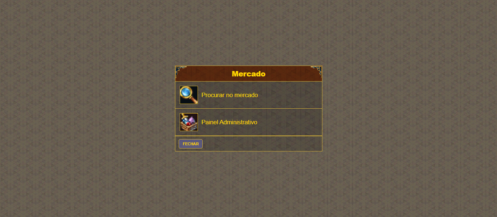

# Game Marketplace UI - Clan & User Shop ⚔️💰

  

Este projeto é uma interface de marketplace inspirada em sistemas de comércio de grandes jogos. O objetivo foi criar uma experiência de navegação fluida para membros de um clã, permitindo a visualização de itens à venda tanto do estoque coletivo do clã quanto do inventário pessoal do usuário.

## 🎯 Conceito e Inspiração
A interface foi pensada para ser imersiva, utilizando elementos visuais que remetem ao universo gamer. O desafio técnico consistiu em organizar diversos produtos de forma que o usuário pudesse alternar rapidamente entre a visão do "Mercado do Clã" e seus "Próprios Anúncios".

## 🚀 Tecnologias e Implementações
- **Frontend:** HTML5 / CSS3 / JavaScript / PHP / MYSQL.
- **UI/UX Gamer:** Uso de transparências, efeitos de hover estilizados e ícones temáticos.
- **Lógica de Exibição:** Filtros dinâmicos para separar produtos por categoria e origem (Clã vs. Usuário).
- **Componentes:**
  - Cards de produto com detalhes de preço e raridade.
  - Sidebar de navegação rápida.
  - Dashboard de saldo e moedas do jogo.

## 🛠️ Funcionalidades
- **Mercado do Clã:** Exibição de itens disponíveis para todos os membros da comunidade.
- **User Shop:** Espaço dedicado para o usuário gerenciar seus próprios itens à venda.
- **Sistema de Categorias:** Organização simplificada para facilitar a busca por itens específicos.
- **Design Adaptativo:** Interface otimizada para manter a imersão em diferentes tamanhos de tela.

## 🌐 Link da Demo
Confira a interface online: [game.islu.com.br](https://game.islu.com.br/)

---
Desenvolvido por **Maisa Rodrigues**
